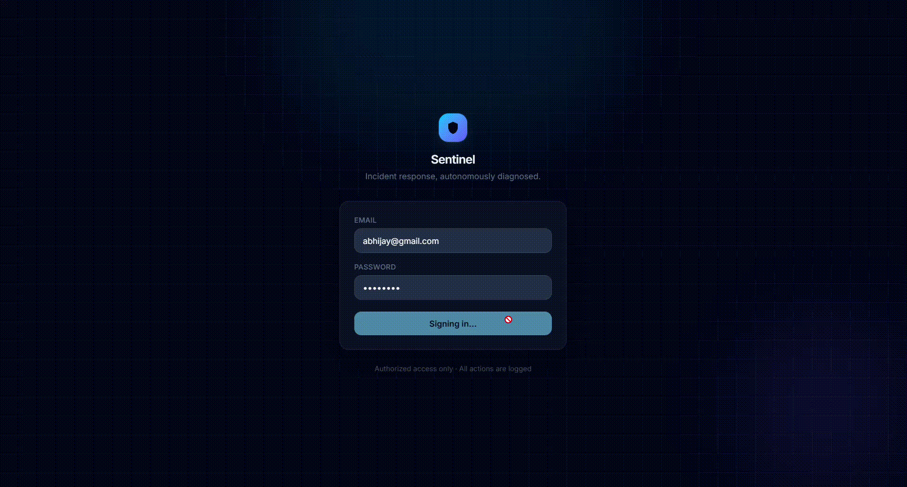
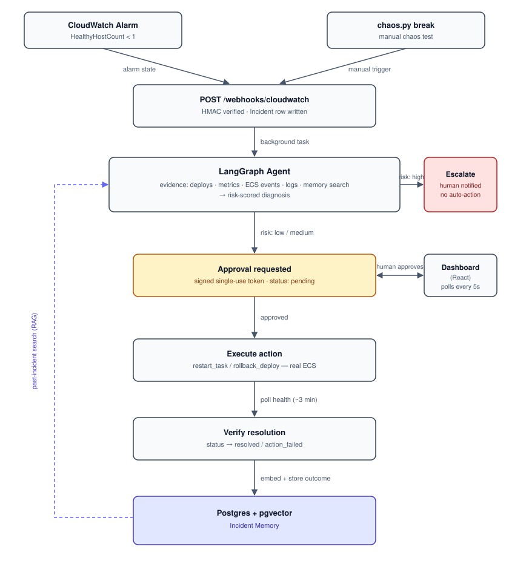

# Sentinel

An AI agent that detects, diagnoses, and — with your approval — fixes real AWS incidents.

Sentinel watches a live ECS service, and when something breaks, a LangGraph agent gathers real evidence (recent deploys, CloudWatch metrics, ECS events, logs, and past incidents it remembers), proposes a root cause and a fix, and routes the decision by risk: low/medium-risk fixes go to a human for one-click approval; high-risk findings are escalated with no auto-action at all. Once approved, the agent executes the fix against the real service, verifies it worked, and stores the outcome so the next diagnosis is informed by this one.

There's a `chaos.py` script that deliberately breaks the deployed service on real AWS infrastructure — not a mock — so the whole loop above can be exercised end to end, including a real ECS crash loop and a real rollback.



## Why this exists

This project is a demonstration of the parts of agent engineering that are easy to skip and hard to fake:

- **A real human-in-the-loop gate.** Approval is a signed, single-use token minted server-side — the agent can't act without it, and a token can't be replayed. High-risk diagnoses are never auto-executed, period.
- **Real infrastructure, not a simulated failure.** `chaos.py` registers a genuinely broken ECS task definition and force-stops the healthy one. The agent's fix is a real `UpdateService` call against a real AWS account.
- **Retrieval over past incidents.** Every resolved incident is embedded and stored in Postgres via pgvector; future diagnoses search it as evidence, not just the live telemetry.
- **A CI/CD pipeline with an actual quality gate.** Beyond lint/typecheck/tests, a push to `main` runs an eval harness that fails the pipeline if diagnosis accuracy regresses — and the deploy step itself health-checks the rollout through the load balancer and auto-rolls-back on failure.
- **Deliberate scope.** Redis/RQ were removed in favor of FastAPI `BackgroundTasks` once it was clear a distributed job queue was solving a scaling problem this project doesn't have at its current size. That's a documented trade-off, not debt — see [Known limitations](#known-limitations).

## Architecture



An alarm (or a manual chaos test) POSTs an HMAC-signed event to the backend, which writes an `Incident` row and hands off to the agent as a background task. The agent gathers evidence with a set of read tools, produces a risk-scored diagnosis, and either escalates (high risk) or requests approval (low/medium risk). A human approves or rejects from the dashboard; an approval mints a single-use token that authorizes exactly one write action. The agent executes it against the real ECS service, polls until the service is healthy again, and stores the outcome as a vector-embedded memory that future diagnoses can retrieve.

## Tech stack

| Layer | Technologies |
|---|---|
| **Frontend** | React, TypeScript, Vite, Tailwind CSS |
| **Backend API** | FastAPI, SQLAlchemy (async), Postgres + pgvector, Alembic, JWT auth (`python-jose`), `bcrypt`, HMAC-signed webhooks, `slowapi` rate limiting, `structlog` |
| **Agent** | LangGraph, OpenAI (`gpt-4o`) via `instructor` for structured outputs, `boto3` read/write tools |
| **Infra** | Terraform, AWS (ECS Fargate, ALB, RDS Postgres, ECR, Lambda, SNS, CloudWatch Alarms, Secrets Manager, IAM, GitHub OIDC) |
| **CI/CD** | GitHub Actions — lint, typecheck, tests, an agent eval gate, and a health-checked auto-deploy with rollback |
| **Testing** | `pytest`, `pytest-asyncio`, an in-memory SQLite test DB, and a real chaos-testing script (`chaos.py`) for end-to-end verification against live AWS |

## Repository layout

```
backend/
  app/
    agent/       # LangGraph graph, nodes, prompts, state
    api/         # FastAPI routers: auth, webhooks, incidents, approvals
    core/        # config, db, security, rate limiting, approval tokens
    jobs/        # diagnose / execute_action / verify — the background pipeline
    models/      # SQLAlchemy models (Incident, Diagnosis, Approval, AuditLog, IncidentMemory)
    tools/       # read tools (deploys, metrics, ecs events, logs, memory search)
                 # write tools (restart_task, rollback_deploy) — gated by approval tokens
  scripts/
    chaos.py       # break / status / fix — chaos-tests a real deployed ECS service
    demo_reset.py  # restores the service and clears incident data between demo runs
    create_user.py
  alembic/       # migrations
frontend/
  src/
    api/client.ts        # typed API client, configurable base URL
    pages/DashboardPage.tsx
    components/          # IncidentList, DiagnosisCard, EvidencePanel, ApprovalActions, AuditLog
infra/
  terraform/     # ECS, ALB, RDS, IAM, the CloudWatch alarm + SNS + Lambda forwarder
  lambda/        # the alarm-forwarder Lambda source
```

## Running it locally

```bash
# 1. Postgres (with pgvector)
docker run -d --name sentinel-postgres-dev -p 5432:5432 \
  -e POSTGRES_PASSWORD=postgres pgvector/pgvector:pg16

# 2. Backend
cd backend
cp .env.example .env   # fill in DATABASE_URL, WEBHOOK_SECRET, JWT_SECRET, OPENAI_API_KEY
uv sync
uv run alembic upgrade head
uv run python -m scripts.create_user you@example.com yourpassword
uv run uvicorn app.main:app --reload

# 3. Frontend
cd frontend
npm install
npm run dev   # http://localhost:5173 — proxies /api to localhost:8000 by default
```

To point the frontend at a deployed backend instead of the local proxy, set `VITE_API_BASE_URL` in `frontend/.env.local` (see `frontend/.env.example`) — the backend's CORS policy needs to allow that origin.

## The chaos test

```bash
uv run python -m scripts.chaos break   # deploys a broken task def, force-stops the healthy task
uv run python -m scripts.chaos status  # watch it crash-loop
uv run python -m scripts.chaos fix     # manual override — normally the agent does this
```

`break` deliberately crashes the real ECS service and notifies the agent directly (rather than waiting on the CloudWatch alarm to round-trip through SNS and Lambda, which can't complete while the service it's supposed to report on is down — see below). From there, the full loop runs live: diagnosis, approval, a real rollback, and verification.

## Known limitations

Documented on purpose, not discovered by accident:

- **The webhook shares fate with the service it monitors.** If the backend goes fully down, the alarm can fire, but nothing can deliver that notification to the backend until it's at least partially reachable again. A production version would decouple incident intake onto separate, always-up infrastructure (e.g. a Lambda writing directly to the database). Scoped out here as disproportionate infra/cost for a project at this scale.
- **`scripts/` isn't in the Docker image.** The runtime image only ships `app/`, so one-off admin scripts (like `create_user.py`) need to run as inline overrides against a deployed task rather than the script file directly.
- **Verification polls for ~3 minutes.** `restart_task` and `rollback_deploy` don't return until the service is confirmed healthy again, so approval-to-resolution isn't instant — that's real infrastructure taking real time, not an artificial delay.

## License

No license file yet — all rights reserved by default. Add one if you want this reused.
